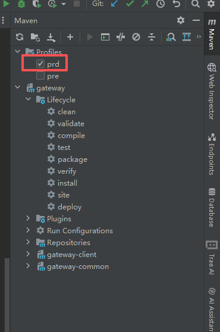
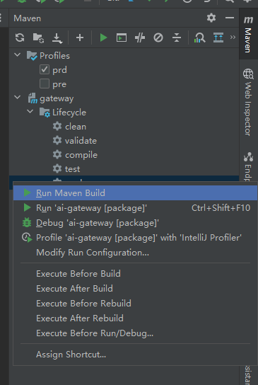
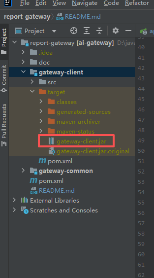
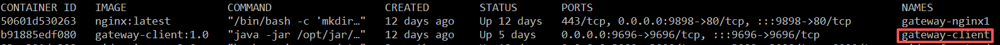

# 天九科技营销智能化gateway系统

### 软件架构
软件架构说明： 系统采用JDK17，springboot2.7.15为基础框架，采用maven管理项目依赖。

### 配置说明
1. 配置文件application.yml
   ```yaml
   server:
     # 服务器的HTTP端口，默认为8080
     port: 9696
     servlet:
       # 应用的访问路径
       context-path: /
     tomcat:
       # tomcat的URI编码
       uri-encoding: UTF-8
       # 连接数满后的排队数，默认为100
       accept-count: 1000
       threads:
         # tomcat最大线程数，默认为200
         max: 800
         # Tomcat启动初始化的线程数，默认值10
         min-spare: 100
   ```
   port是访问端口的配置，可以根据实际情况修改，此文件其他配置不需要修改。

2. 配置文件application-@profiles.active@.yml
说明：@profiles.active@为主pom的profiles.profile配置，默认值为pre。 测试环境下，起作用的配置文件是application-pre.yml。
生产环境下，起作用的配置文件是application-prd.yml。
```yaml
sys:
    feishu:
        app-id: cli_a98*********900b
        app-secret: X5iNG**********xDpKBzynl
    coze:
        agent-name: 天九科技营销周报
        workflow-id: 75**************54
        app-id: 75**********546
        secret-token: sat_lYUYfky****************uRMQeSSnlcsrTKQxWScYbxdqEQW
        url: https://api.coze.cn
        connect-timeout: 10000
        read-timeout: 610000
        time-span: 7

spring:
    servlet:
        multipart:
            max-file-size: 10MB
            max-request-size: 50MB

logging:
    config: classpath:logback/logback-prd.xml
```
feishu节点下是飞书的app-id和app-secret配置，用于飞书API访问的认证，可根据实际情况修改。

coze节点下是扣子的配置，用于扣子API访问的认证，可根据实际情况修改。

    agent-name是扣子的应用名称，这个配置没有使用，可以不用管。
    workflow-id是扣子的工作流ID，可根据实际情况修改。
    app-id是扣子的应用ID，可根据实际情况修改。
    secret-token是扣子的应用密钥，可根据实际情况修改。
    url是扣子的API访问地址，地址变动不会频繁，不需要修改。
    connect-timeout是扣子的连接超时时间（单位：毫秒），可根据实际情况修改。
    read-timeout是扣子的读取超时时间（单位：毫秒），可根据实际情况修改。
    time-span是报告的时间间隔（单位：天），可根据实际情况修改。

其他参数保持现在的配置即可。

### 打包说明
建议使用编辑器（如IDEA）打开项目，配置好JDK和Maven。




如果打生产包选择勾选prd，点击package，然后点击右键，选择Run Maven Build。执行完成会gateway-client\target目录下生成gateway-client.jar。
如下图：



### 部署说明-html前端部署
将打包好的html前端文件拷贝到服务器/opt/tianjiu_report/nginx/html目录下，覆盖原来的文件就可以了。

### 部署说明-jar包部署
将打包好的gateway-client.jar拷贝到服务器/opt/tianjiu_report/app目录下，覆盖原来的jar文件。
然后执行以下命令重启gateway-client容器服务：

```shell
docker restart gateway-client
```

### 运维说明
生产环境是使用的docker容器，运维时可以使用docker命令进行操作。
     
     /opt/tianjiu_report/app 部署的是gateway-client.jar应用
     /opt/tianjiu_report/nginx 部署的是nginx
1. nginx目录如下：

       /opt/tianjiu_report/nginx/html 部署html前端文件
       /opt/tianjiu_report/nginx/conf 是nginx配置文件
       /opt/tianjiu_report/nginx/logs 是nginx日志目录
       /opt/tianjiu_report/nginx/dockerfile 是生成nginx镜像文件
2. gateway-client目录如下：

       /opt/tianjiu_report/app/gateway-client.jar 部署gateway-client.jar应用
       /opt/tianjiu_report/app/dockerfile 是生成gateway-client镜像文件
       /opt/tianjiu_report/app/logs 是gateway-client应用的日志目录

       在/opt/tianjiu_report/app/logs目录下有sys-info.log文件，这个是应用的实时日志，查询日志可看这个文件。
       sys-error.log这个是系统异常错误日志文件，查询系统异常或者错误可查看这个文件。其他都是日志备份文件。
    


